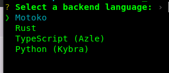
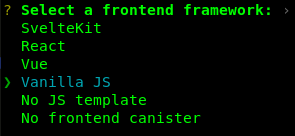
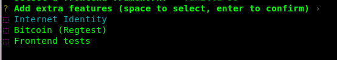

## Creating a New Project
All dapps on ICP start off as projects. Projects are created using the `dfx` command and subcommands.

### Step 1: Open a terminal window on your local computer.
- Assure that you are in your working directory
### Step 2: Create a new project with the name 'hello_world' with the command:
```bash
dfx new hello_world
```
- You will be prompted to select the language that your backend canister will use:


- Then, select a frontend framework for your frontend canister. In this example, select:


- Lastly, you can include extra features to be added to your project:



Next Section: [Introduction to Motoko](./INTRO-TO-MOTOKO.md)